## 矩阵的几何直观
> 矩阵首先是一种数学形式, 数学几何不分家，从几何上理解矩阵是很有意思的。  
> 很多领域的工作离不开矩阵，所以写本文摘录一些理解角度，作为笔记
--- 

## 矩阵

### 向量视角

例子矩阵为$\mathbf{X}\in \mathbb{R}^{2\times 3}$：
$$
\mathbf{X}=
\begin{bmatrix}
1 & 2 & 3\\ 
4 & 5 & 6
\end{bmatrix}
$$

#### 行向量、列向量

这是一个2行3列矩阵，若分别聚焦于`行`、`列`视角，可分为：
 - 行视角。这是一个集成了2行`行向量` $v$ 的矩阵，其中$\mathbf{v} \in \mathbb{R}^{1\times 3}$
 - 列视角。这是一个集成了3列`列向量` $v$ 的矩阵，其中$\mathbf{v} \in \mathbb{R}^{1\times 2}$

行、列视角下，矩阵分别表示为：
$$
\mathbf{X}_{\text{row}}=
\begin{bmatrix}
\color{#ff8383}1 & \color{#ff8383}2 & \color{#ff8383}3\\
\color{#56a2e8}4 & \color{#56a2e8}5 & \color{#56a2e8}6
\end{bmatrix}
\qquad
\mathbf{X}_{\text{col}}=
\begin{bmatrix}
{\color{#ff8383}1} & {\color{#56a2e8}2} & {\color{#39994b}3}\\
{\color{#ff8383}4} & {\color{#56a2e8}5} & {\color{#39994b}6}
\end{bmatrix}
$$

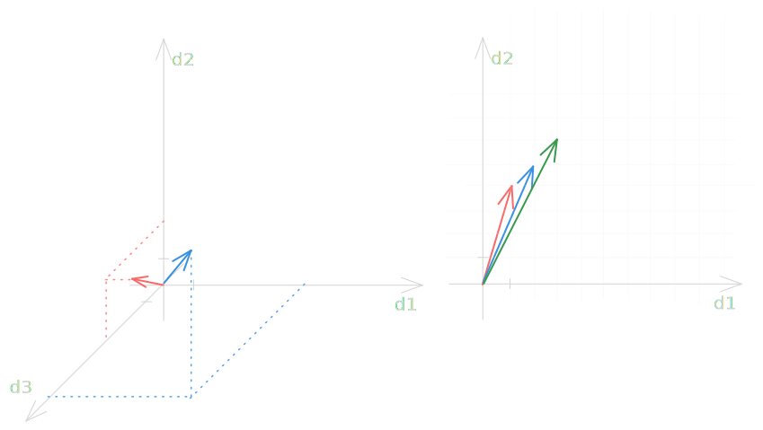
*行向量、列向量的几何直观*

#### 单维矩阵向量

其中，`单行`或`单列`矩阵是一个更特殊的角色，拿单行举例，有$\mathbf{X}\in \mathbb{R}^{1\times 2}$。  
从列视角来看：
$$
\mathbf{X}=
\begin{bmatrix}
{\color{#ff8383}1} & {\color{#56a2e8}3}
\end{bmatrix}
$$

它的列向量空间为：

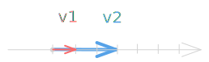
*单维列向量的几何直观*

两个向量点积的几何直观里，将会使用到这个直观。  

向量的部分暂时到此。

### 图视角

矩阵同样在图论下存在几何直观, 举例：
$$
\mathbf{A}=
\begin{bmatrix}
0 & 1 & 1 & 0 & 0 \\
0 & 0 & 1 & 0 & 0 \\
1 & 0 & 0 & 1 & 0 \\
0 & 0 & 0 & 0 & 1 \\
0 & 0 & 0 & 1 & 1 
\end{bmatrix}
\in
\mathbb{R}^{5\times 5}
$$

#### 有向图

从`行视角`来看，它可以落成5个图空间中的点, 每一行是含有5个维度的点。  
对于每个点，其维度n代表着该点和第n个点的联系, 图空间中表示为边。
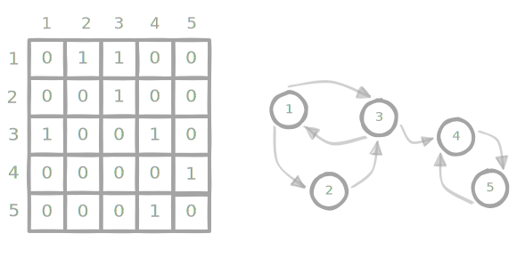
*有向图*

将矩阵的数值从0,1拓展到更多数值，作为联系的边就可以拓展出**权重**的信息：
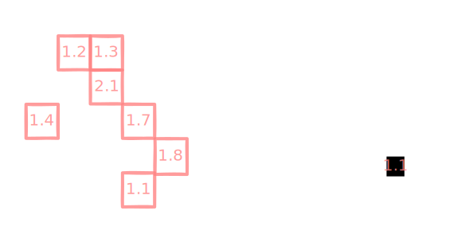
*有向权重图*

#### 无向图
调整矩阵值即可调整边关系, 使其变为无向图

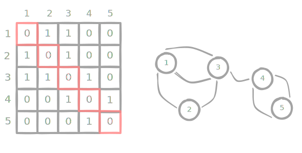
*无向图(可见局部对称关系)*

#### 图的连通性
我们回到最初的矩阵，这次从图的**连通性**上观察，整图可以分为
 - 强连通分量(`红色`、`绿色`部分)
 - 分量连接区(`蓝色`部分)

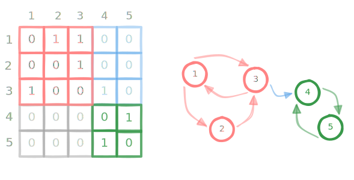
*图的连通性*

--- 

## 矩阵运算

### 矩阵加减

若两个矩阵$\mathbf{A}\in \mathbb{R}^{n_1\times m_1}$和$\mathbf{B}\in \mathbb{R}^{n_2\times m_2}$进行矩阵加减运算，则两个矩阵的维度必需一致，也就是$n_1=n_2, m_1=m_2$

在该运算前提约束下，矩阵加减可直观为矩阵内`行向量`,`列向量`的逐个加减。这里用列向量的视角举例:

$$
\mathbf{C}=
\mathbf{A}+\mathbf{B}=
\begin{bmatrix}
{\color{#ff8383}1}\\  
{\color{#ff8383}4}
\end{bmatrix}+
\begin{bmatrix}
{\color{#56a2e8}4}\\  
{\color{#56a2e8}2}
\end{bmatrix}=
\begin{bmatrix}
{\color{#39994b}5}\\  
{\color{#39994b}6}
\end{bmatrix}
$$

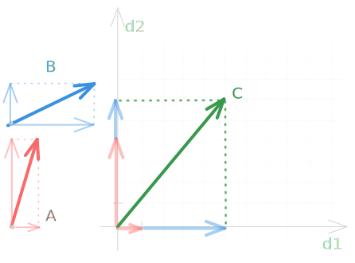
*矩阵的向量相加*

### 矩阵乘法

若两个矩阵$\mathbf{A}\in \mathbb{R}^{n_1\times m_1}$和$\mathbf{B}\in \mathbb{R}^{n_2\times m_2}$进行矩阵乘法运算，则前置条件为$m1=n2$, 也就是`A的列数=B的行数`。

这是为什么？我们从行列视角的几何直观说起。

#### 线性变换视角

##### 列向量的线性投影

不妨看，三个$2\times2$矩阵分别与同一个$2\times1$矩阵$\mathbf{R}$相乘：

首先是，${\color{#a4a4a4}\mathbf{N}}$和${\color{#ff8383}\mathbf{R}}$:
$$
{\color{#a4a4a4}\mathbf{N}}{\color{#ff8383}\mathbf{R}}=
{\color{#a4a4a4}
\begin{bmatrix}
1 & 0\\
0 & 1
\end{bmatrix}}
{\color{#ff8383}
\begin{bmatrix}
2\\
1
\end{bmatrix}}=
\begin{bmatrix}
2\\
1
\end{bmatrix}\\
$$

我特意为${\color{#a4a4a4}\mathbf{N}}$矩阵上了**N**ickel(银灰)色，这当然是有目的的。
请看这个运算的几何直观图：

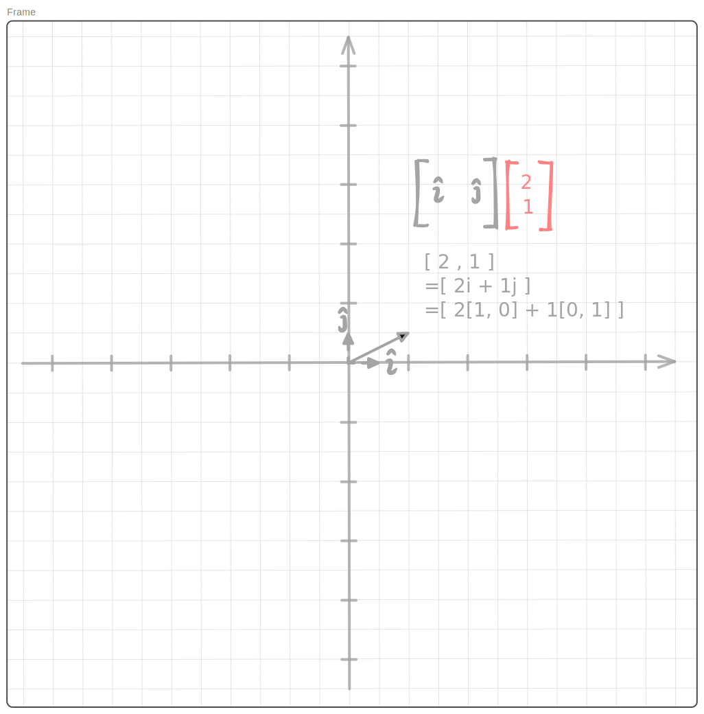
*线性变换N*

图中可见一个经典的`二维笛卡尔坐标系`，它所处的是一个${\color{#a4a4a4}\text{灰}}$色的**二**维**线性空间**。
在空间中，${\color{#ff8383}\mathbf{R}}$矩阵的唯一一个列向量${\color{#ff8383}\begin{bmatrix}2\\1\end{bmatrix}}$落在坐标轴上$(2, 1)$的位置。

> 这不是废话吗？向量$(2, 1)$当然要落在(2, 1)的位置

不，直观的核心就在其中。当我们要将向量完美落在`二维笛卡尔坐标系`上时，有如下条件：  
- 向量是二维, 也就是$(x1, y1)$
- 向量的形式需要从$(x1, y1)$转变为$(x1·\hat{i}, y1·\hat{j})$ 

其中，其中，$\hat{i}, \hat{j}$是该二维张成空间的**基(Basis)**，当前我们关注的是向量，所以可称**基向量(Basis Vector)**。   

图中直观所得, ${\color{#a4a4a4}\text{灰}}$色的**二**维线性空间, ${\color{#a4a4a4}\mathbf{N}}$矩阵以及${\color{#ff8383}\mathbf{R}}$矩阵三者存在联系:  
- 向量基${\color{#a4a4a4}\hat{i}, \hat{j}}$正是${\color{#a4a4a4}\mathbf{N}}$矩阵的两个列向量${\color{#a4a4a4}\begin{bmatrix}0\\1\end{bmatrix},\begin{bmatrix}0\\1\end{bmatrix}}$，且基数量等于${\color{#ff8383}\mathbf{R}}$的列向量维度, 也即矩阵行数

这就是列视角的直观核心。
- 矩阵${\color{#a4a4a4}\mathbf{N}}$的列作为空间的基，张成线性空间
- 矩阵${\color{#ff8383}\mathbf{R}}$的列向量各自落入该线性空间(列向量维度=空间基的数量)

从几何直观角度，本次矩阵乘积代表矩阵${\color{#ff8383}\mathbf{R}}$的列向量群在矩阵${\color{#a4a4a4}\mathbf{N}}$空间的**线性映射**结果, 换一个表达，矩阵${\color{#ff8383}\mathbf{R}}$发生了矩阵${\color{#a4a4a4}\mathbf{N}}$定义的**线性变换**。

矩阵${\color{#a4a4a4}\mathbf{N}}$是一个特别的线性变换, 它的基向量${\color{#a4a4a4}\hat{i}, \hat{j}}$正是单位向量本身，所有列向量维度为2的矩阵经过该线性变换的映射结果为本身。所以它有个特别的名称——**单位矩阵**，所定义的线性变换称作**恒等变换**。

我们再举些别的例子:
$$
{\color{#39994b}\mathbf{G}}{\color{#ff8383}\mathbf{R}}=
{\color{#39994b}
\begin{bmatrix}
2 & -3\\
3 & 2
\end{bmatrix}}
{\color{#ff8383}
\begin{bmatrix}
2\\
1
\end{bmatrix}}=
\begin{bmatrix}
1\\
8
\end{bmatrix}\\
$$

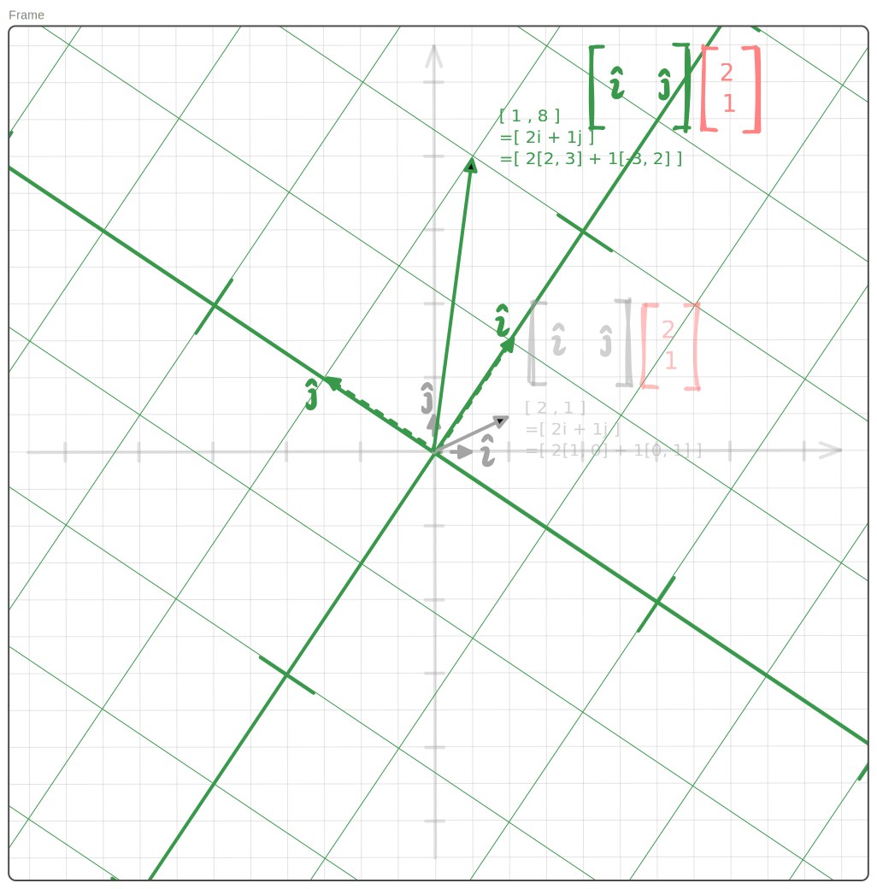
*线性变换G*

如图，矩阵${\color{#39994b}\mathbf{G}}$的基向量是${\color{#39994b}\hat{i}, \hat{j}}$。
这对基向量可以通过左乘单位矩阵的方式(恒等变化)得到N空间中的投影:  
-数学表示为${\color{#a4a4a4}\mathbf{N}}{\color{#39994b}\mathbf{G}}={\color{#39994b}\mathbf{G}}$,   
-投影为${\color{#39994b}\hat{i}=\begin{bmatrix}2\\3\end{bmatrix},\hat{j}=\begin{bmatrix}-3\\2\end{bmatrix}}$,  
-线性变换${\color{#39994b}\mathbf{G}}$直观为把原空间基进行了大约$60°$逆时针旋转, 同时进行了略大于3倍的放大。

再看一个:
$$
{\color{#56a2e8}\mathbf{B}}{\color{#ff8383}\mathbf{R}}=
{\color{#56a2e8}
\begin{bmatrix}
-3 & -3\\
3 & -3
\end{bmatrix}}
{\color{#ff8383}
\begin{bmatrix}
2\\
1
\end{bmatrix}}=
\begin{bmatrix}
-9\\
3
\end{bmatrix}
$$

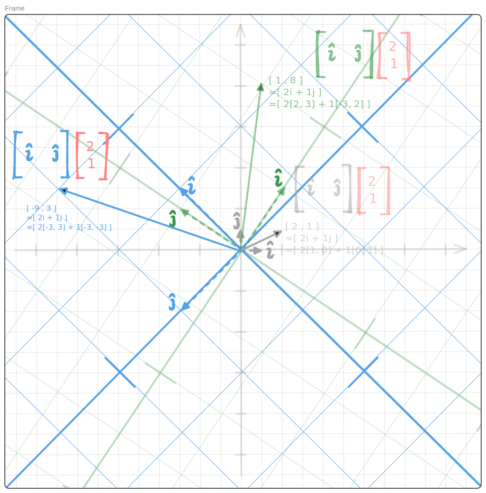
*线性变换B*

几何直观清晰可见：
- 投影为${\color{#56a2e8}\hat{i}=\begin{bmatrix}-3\\3\end{bmatrix},\hat{j}=\begin{bmatrix}-3\\-3\end{bmatrix}}$,  
- 线性变换${\color{#56a2e8}\mathbf{N}}$直观为把单位空间基进行了$135°$逆时针旋转, 同时进行了略大于4倍的放大。

我们把握了规律。  
上述的二维矩阵可以从旋转，缩放的视角进行几何直观，它看起来就像眼前的一张纸面，经过倾斜，拉远近所得到的不同视野呈现。实际上也就是这样子，除了旋转和缩放还存在其它方式，想象一下，如果一张纸面在你眼前突然变成一条线，它所对应的二维矩阵是什么呢？请自行展开。

回到矩阵乘法上来。在前面的几个例子中：
$$
{\color{#a4a4a4}\mathbf{N}}{\color{#ff8383}\mathbf{R}}\\
{\color{#39994b}\mathbf{G}}{\color{#ff8383}\mathbf{R}}\\
{\color{#56a2e8}\mathbf{B}}{\color{#ff8383}\mathbf{R}}
$$
会发现，列向量的线性变换其实存在顺序,矩阵$\mathbf{A}$乘$\mathbf{B}$:  
- 公式形式，写作$\mathbf{A}\mathbf{B}$,
- 直观逻辑上, 它代表**左侧**的矩阵$\mathbf{A}$定义的线性变换作用于**右侧**$\mathbf{B}$内的列向量

我们可以通过函数形式理解，让公式自然一些：
$$
{\color{#a4a4a4}\mathbf{n}}({\color{#ff8383}\mathbf{R}})\\
{\color{#39994b}\mathbf{g}}({\color{#a4a4a4}\mathbf{n}}({\color{#ff8383}\mathbf{R}}))\\
{\color{#56a2e8}\mathbf{b}}({\color{#a4a4a4}\mathbf{n}}({\color{#ff8383}\mathbf{R}}))
$$

现在，带着线性变换的几何直观，我们来思考一个问题。  
假设${\color{#56a2e8}\mathbf{B}}$的线性变换效果是由几个不同矩阵的线性变换**组合**成的，比如
$$
\begin{aligned}
{\color{#56a2e8}\mathbf{B}}
&={\color{#e28ef8}\mathbf{P}}{\color{#39994b}\mathbf{G}}
\\
{\color{#56a2e8}
\begin{bmatrix}
-3 & -3\\
3 & -3
\end{bmatrix}}
&={\color{#e28ef8}
\begin{bmatrix}
\hat{i} & \hat{j}
\end{bmatrix}}
{\color{#39994b}
\begin{bmatrix}
2 & -3\\
3 & 2
\end{bmatrix}}
\end{aligned}
$$

你能想象出来线性变换${\color{#e28ef8}\mathbf{P}}$的几何直观吗？  
结果见[附录-线性变换P](#线性变换p)。

##### 行向量的线性投影

如果熟悉了上面列向量的线性变换视角，那么行向量的情况就很好理解了。

请看线性变换如图：

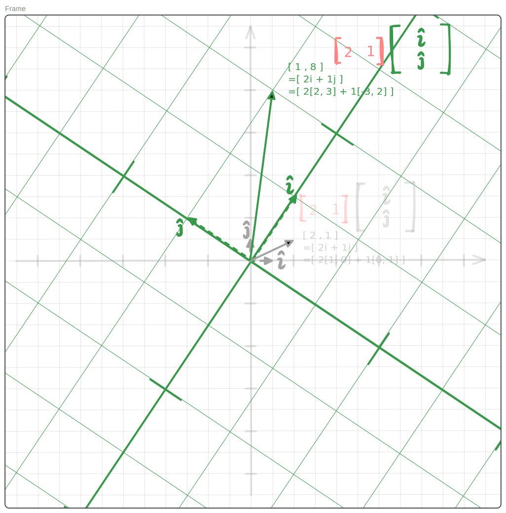
*线性变换G-行向量视野*

> 乍一看，完全是之前的线性变化${\color{#39994b}\mathbf{G}}$。

没错，正是如此！
但不同处在于，图中几何直观代表的是线性变化${\color{#39994b}\mathbf{G^T}}$，所涉及的矩阵乘积为:
$$
\begin{aligned}
{\color{#ff8383}\mathbf{R^T}}{\color{#39994b}\mathbf{G^T}}&=
{\color{#ff8383}
\begin{bmatrix}
2 & 1
\end{bmatrix}}
{\color{#39994b}
\begin{bmatrix}
2 & 3\\
-3 & 2
\end{bmatrix}}&=
{\color{#ff8383}
\begin{bmatrix}
2 & 1
\end{bmatrix}}
{\color{#39994b}
\begin{bmatrix}
\hat{i}\\
\hat{j}
\end{bmatrix}}&=
\begin{bmatrix}
1 & 8\\
\end{bmatrix}
\end{aligned}
$$

对比之前列向量视角
> 列向量的线性变换其实存在顺序,矩阵$\mathbf{A}$乘$\mathbf{B}$:  
> - 公式形式，写作$\mathbf{A}\mathbf{B}$,
> - 直观逻辑上, 它代表**左侧**的矩阵$\mathbf{A}$定义的线性变换作用于**右侧**$\mathbf{B}$内的列向量

以同样的方式表达行向量视角的规律：  

行向量的线性变换存在顺序，矩阵$\mathbf{A}$乘$\mathbf{B}$: 
- 公式形式上，写作$\mathbf{A}\mathbf{B}$,
- 直观逻辑上，它代表**右侧**的矩阵$\mathbf{B}$定义的线性变换作用于**左侧**$\mathbf{A}$内的行向量

列向量线性投影视角下的矩阵乘法${\color{#39994b}\mathbf{G}}{\color{#ff8383}\mathbf{R}}$，   
行向量线性投影视角下的矩阵乘法${\color{#ff8383}\mathbf{R^T}}{\color{#39994b}\mathbf{G^T}}$

在我们的例子中，它们的几何直观，都表示为：  
**同一矩阵${\color{#ff8383}\mathbf{R}}$内的向量, 被投影到同一组基向量${\color{#39994b}\hat{i},\hat{j}}$所张成的线性空间** 

#### 内积(点积/数量积)视角 - 行x列

设左矩阵$\mathbf{A}\in\mathbb{R}^{m\times n}$，右矩阵$\mathbf{B}\in\mathbb{R}^{n\times p}$。  
有矩阵乘法公式为:
$$
\begin{aligned}
\mathbf{C}=\mathbf{A}\mathbf{B}
&= \begin{bmatrix}
a_{11} & a_{12} & \cdots & a_{1n}\\
a_{21} & a_{22} & \cdots & a_{2n}\\
\vdots & \vdots & \ddots & \vdots\\
a_{m1} & a_{m2} & \cdots & a_{mn}
\end{bmatrix}
\begin{bmatrix}
b_{11} & b_{12} & \cdots & b_{1p}\\
b_{21} & b_{22} & \cdots & b_{2p}\\
\vdots & \vdots & \ddots & \vdots\\
b_{n1} & b_{n2} & \cdots & b_{np}
\end{bmatrix}
\\[1em]
&= \begin{bmatrix}
\mathbf{a}_1^\mathsf{T}\\
\mathbf{a}_2^\mathsf{T}\\
\vdots\\
\mathbf{a}_m^\mathsf{T}
\end{bmatrix}
\begin{bmatrix}
\mathbf{b}_1 & \mathbf{b}_2 & \cdots & \mathbf{b}_p
\end{bmatrix}
\\[1em]
&= \begin{bmatrix}
\mathbf{a}_1^\mathsf{T}\mathbf{b}_1 & \mathbf{a}_1^\mathsf{T}\mathbf{b}_2 & \cdots & \mathbf{a}_1^\mathsf{T}\mathbf{b}_p\\
\mathbf{a}_2^\mathsf{T}\mathbf{b}_1 & \mathbf{a}_2^\mathsf{T}\mathbf{b}_2 & \cdots & \mathbf{a}_2^\mathsf{T}\mathbf{b}_p\\
\vdots & \vdots & \ddots & \vdots\\
\mathbf{a}_m^\mathsf{T}\mathbf{b}_1 & \mathbf{a}_m^\mathsf{T}\mathbf{b}_2 & \cdots & \mathbf{a}_m^\mathsf{T}\mathbf{b}_p
\end{bmatrix}
\\[1em]
&= \begin{bmatrix}
c_{11} & c_{12} & \cdots & c_{1p}\\
c_{21} & c_{22} & \cdots & c_{2p}\\
\vdots & \vdots & \ddots & \vdots\\
c_{m1} & c_{m2} & \cdots & c_{mp}
\end{bmatrix},
\end{aligned}
$$

其中。$\mathbf{A}$的第$i$个**行向量**记作$\mathbf{a}_i^\mathsf{T}\in\mathbb{R}^{1\times n}$，  $\mathbf{B}$的第$j$个**列向量**记作$\mathbf{b}_j\in\mathbb{R}^{n\times 1}$。

结果矩阵$\mathbf{C}$的第$i$行，第$j$列元素记作$\mathbf{c}_{ij}$, 所表示的是左矩阵行向量$\mathbf{a}_i^\mathsf{T}$和右矩阵列向量$\mathbf{b}_j$的**点积**：
$$
c_{ij}=
\mathbf{a}_i^\mathsf{T}\mathbf{b}_j=
\sum_{k=1}^{n}a_{ik}b_{kj}
$$

我们来通过例子来逐步走入其直观：
$$
\begin{aligned}
\mathbf{C}={\color{#ff8383}\mathbf{A}}{\color{#56a2e8}\mathbf{B}}
&=
{\color{#ff8383}
\begin{bmatrix}
3 & 2 & 1\\
6 & 4 & 2\\
1 & 2 & 5
\end{bmatrix}}
{\color{#56a2e8}
\begin{bmatrix}
1 & 2\\
3 & 1\\
0 & 4
\end{bmatrix}}
\\
&=
{\color{#ff8383}
\begin{bmatrix}
\mathbf{a}_1^\mathsf{T}\\
\mathbf{a}_2^\mathsf{T}\\
\mathbf{a}_3^\mathsf{T}
\end{bmatrix}}
{\color{#56a2e8}
\begin{bmatrix}
\mathbf{b}_1 & \mathbf{b}_2
\end{bmatrix}}
\\
&=
\begin{bmatrix}
{\color{#ff8383}\mathbf{a}_1^\mathsf{T}}{\color{#56a2e8}\mathbf{b}_1} & {\color{#ff8383}\mathbf{a}_1^\mathsf{T}}{\color{#56a2e8}\mathbf{b}_2}\\
{\color{#ff8383}\mathbf{a}_2^\mathsf{T}}{\color{#56a2e8}\mathbf{b}_1} & {\color{#ff8383}\mathbf{a}_2^\mathsf{T}}{\color{#56a2e8}\mathbf{b}_2}\\
{\color{#ff8383}\mathbf{a}_3^\mathsf{T}}{\color{#56a2e8}\mathbf{b}_1} & {\color{#ff8383}\mathbf{a}_3^\mathsf{T}}{\color{#56a2e8}\mathbf{b}_2}
\end{bmatrix}
=\begin{bmatrix}
{\color{#ff8383}\mathbf{a}_1}\cdot{\color{#56a2e8}\mathbf{b}_1} & {\color{#ff8383}\mathbf{a}_1}\cdot{\color{#56a2e8}\mathbf{b}_2}\\
{\color{#ff8383}\mathbf{a}_2}\cdot{\color{#56a2e8}\mathbf{b}_1} & {\color{#ff8383}\mathbf{a}_2}\cdot{\color{#56a2e8}\mathbf{b}_2}\\
{\color{#ff8383}\mathbf{a}_3}\cdot{\color{#56a2e8}\mathbf{b}_1} & {\color{#ff8383}\mathbf{a}_3}\cdot{\color{#56a2e8}\mathbf{b}_2}
\end{bmatrix}\\
&=
\begin{bmatrix}
9 & 12\\
18 & 24\\
7 & 24
\end{bmatrix}
\end{aligned}
$$

其中，取任意一对点积${\color{#ff8383}q} \cdot {\color{#56a2e8}k} = {\color{#ff8383}a_i} \cdot {\color{#56a2e8}b_j}$，其公式展开为：
$$
{\color{#ff8383}\mathbf{q}}\cdot{\color{#56a2e8}\mathbf{k}}=
{\color{#ff8383}
\begin{bmatrix}
q_1 & q_2 & q_3
\end{bmatrix}}
{\color{#56a2e8}
\begin{bmatrix}
k_1 \\ 
k_2 \\ 
k_3
\end{bmatrix}}=
\begin{bmatrix}
{\color{#ff8383}q_1}{\color{#56a2e8}k_1} + {\color{#ff8383}q_2}{\color{#56a2e8}k_2} + {\color{#ff8383}q_3}{\color{#56a2e8}k_3}
\end{bmatrix}
$$

这个**运算过程**的几何直观见：

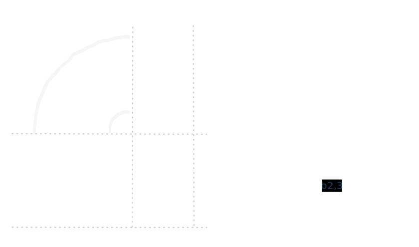
*行列点积*

看起来是个网络结构，其中：

- 红色行向量(**对象**) - 构成网络左侧节点，
- 蓝色列向量(**算子**) - 构成连接边
- 绿色行向量(**点积结果**) - 构成网络右侧结果节点

左矩阵的行向量和右矩阵的列向量的点积运算$a_i^Tb_j=a_i \cdot b_j$的结果形式为数值（在矩阵结果中不会被表达为1x1的矩阵）。

这个数值除了可以直观为上面网络结构的绿色节点外，它还有更普遍的直观形式。

##### 向量点积直观

两个向量的点积运算${\color{#ff8383}q} \cdot {\color{#56a2e8}k}$（我偷偷地减少了维度为了后续演示）, 它其实有个隐藏等式:
$$
\begin{aligned}
{\color{#ff8383}\mathbf{q}}\cdot{\color{#56a2e8}\mathbf{k}}=
{\color{#ff8383}(q_1 , q_2)\cdot}
{\color{#56a2e8}(k_1, k_2)}
&=
{\color{#ff8383}q_1}{\color{#56a2e8}k_1}+
{\color{#ff8383}q_2}{\color{#56a2e8}k_2}\\
&=
\begin{bmatrix}
{\color{#ff8383}q_1}{\color{#56a2e8}k_1} + 
{\color{#ff8383}q_2}{\color{#56a2e8}k_2}
\end{bmatrix}\\
&=
{\color{#ff8383}
\begin{bmatrix}
q_1 \\
q_2
\end{bmatrix}}
\cdot
{\color{#56a2e8}
\begin{bmatrix}
k_1 \\ 
k_2 
\end{bmatrix}}\\
&=
{\color{#ff8383}
\begin{bmatrix}
q_1 & q_2
\end{bmatrix}}
{\color{#56a2e8}
\begin{bmatrix}
k_1 \\ 
k_2 
\end{bmatrix}}\\
&=
{\color{#56a2e8}
\begin{bmatrix}
k_1 & k_2 
\end{bmatrix}}
{\color{#ff8383}
\begin{bmatrix}
q_1 \\
q_2
\end{bmatrix}}
\end{aligned}
$$

从我们前面的[线性变换视角](#线性变换视角)来看，只要能把握到$\hat{i},\hat{j}$,等式的运算很好理解, 所发生的就是单个向量定义的线性空间作用于另一向量，留给我们的问题, 当$\hat{i},\hat{j}$的维度为1时，如何对它定义的线性空间进行几何直观呢？  

我们往式子里填一些数，有：
$$
{\color{#ff8383}\mathbf{q}}\cdot{\color{#a4a4a4}\mathbf{k}}=
{\color{#ff8383}
\begin{bmatrix}
3 & 2
\end{bmatrix}}
{\color{#a4a4a4}
\begin{bmatrix}
x \\ 
y 
\end{bmatrix}}
$$

此时，$\color{#ff8383}\hat{i}=[3], \hat{j}=[2]$, 那么它所定义的线性空间是？
推导如下：

首先，在单位向量的线性空间中，向量$q=(3, 2)$投影其中。  

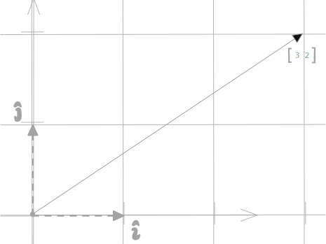
*向量$(3, 2)$*

接着，我们放置一个单位数轴(长度为1), 正方向对齐向量$q=(3, 2)$。
其它向量可以通过正交投影的方式，落到这个数轴上得到新的表达，并且这个过程满足：
1. 单位空间中的向量加法，在落到数轴上仍然成立（可加性）
2. 单位空间中的方向相同，长度不同的向量，在落在数轴上仍然保持相同比例(齐次性)

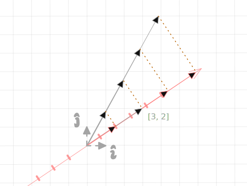
*向量正交投影于数轴*

猜想:
向量$k$经一维矩阵$\begin{bmatrix}3 & 2\end{bmatrix}$所定义的线性变换作用后，结果可直观为向量在数轴上正交投影的长度。 

如果真是如此，在单位矩阵定义空间下, 应有:
- $\begin{bmatrix} 3 & 2 \end{bmatrix}\begin{bmatrix}a \\ b \end{bmatrix}$结果等于$(a, b)$的投影长度

而部分向量的投影情况如下图：
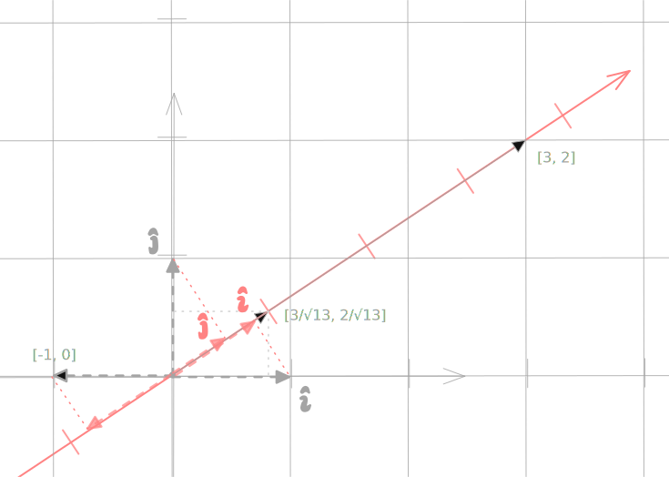
*部分向量的投影情况*
- $(1, 0)$的有向投影长度为$3/\sqrt{13}$, 而  
$$\begin{bmatrix}3 & 2\end{bmatrix}\begin{bmatrix}1 \\ 0\end{bmatrix}
=(3, 2)\cdot(1, 0)=3\cdot1 + 2\cdot0 =3 = \sqrt{13} \cdot 3/\sqrt{13}
$$

- $(-1, 0)$的有向投影长度为$-3/\sqrt{13}$, 而  
$$\begin{bmatrix}3 & 2\end{bmatrix}\begin{bmatrix}-1 \\ 0\end{bmatrix}
=(3, 2)\cdot(-1, 0)=3\cdot(-1) + 2\cdot0 =-3 = -\sqrt{13} \cdot 3/\sqrt{13}
$$

- $(0, 1)$的有向投影长度为$2/\sqrt{13}$, 而  
$$\begin{bmatrix}3 & 2\end{bmatrix}\begin{bmatrix}0 \\ 1\end{bmatrix}
=(3, 2)\cdot(0, 1)=3\cdot0 + 2\cdot1 =2 = \sqrt{13} \cdot 2/\sqrt{13}
$$

- $(3, 2)$的有向投影长度为$\sqrt{13}$, 而  
$$\begin{bmatrix}3 & 2\end{bmatrix}\begin{bmatrix}3 \\ 2\end{bmatrix}
=(3, 2)\cdot(3, 2)=3\cdot3 + 2\cdot2 = 13 = \sqrt{13} \cdot \sqrt{13}
$$

猜想不成立。不过我们惊奇地发现：**差距存在于**$\sqrt{13}$,$-\sqrt{13}$
那么假设我们的数轴单位长度由$1$变成$\sqrt{13}$, 如图：

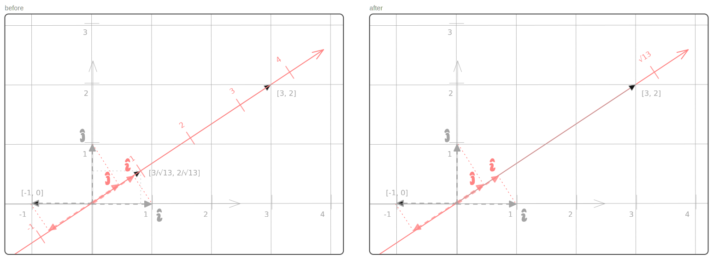
*数轴单位长度变化*

对上了：
$$
\begin{aligned}
\begin{bmatrix}3 & 2\end{bmatrix}\begin{bmatrix}3 \\ 2\end{bmatrix}
&=(3, 2)\cdot(3, 2)\\
&=3\cdot3 + 2\cdot2 = 13\\
&= \sqrt{13} \cdot \sqrt{13}\\
&= 正交投影所处数轴方向的刻度读数 \times 正交投影长度
\end{aligned}
$$

所以，向量$k$经一维矩阵$\begin{bmatrix}3 & 2\end{bmatrix}$所定义的线性变换作用后，结果可直观为:  
**向量k在单位长度等于向量$(3, 2)$的数轴上正交投影的长度$\times$投影所落数轴方向的刻度读数**

那么，左图的数轴所对应的是哪个一维矩阵呢？请自行展开。

> 本证明参考数学博主3Blue1Brown的[线性代数的本质:点积与对偶性](https://www.bilibili.com/video/BV1ys411472E/?p=10&vd_source=7cdf485bd720fdd9fd4cfb796e8c4d48), 他的线性合集非常值得观看。

完成向量点积的直观，我们从点积视角去理解矩阵运算就更形象了。

#### 外积视角 - 列x行

设$\mathbf{A}$的第$k$个列向量记作$\mathbf{a}_k\in\mathbb{R}^{m\times 1}$，$\mathbf{B}$的第$k$个行向量记作$\mathbf{b}_k^\mathsf{T}\in\mathbb{R}^{1\times p}$，则外积视角的数学公式为：

$$
\begin{aligned}
\mathbf{C}=\mathbf{A}\mathbf{B}
&=\begin{bmatrix}
a_{11} & a_{12} & \cdots & a_{1n}\\
a_{21} & a_{22} & \cdots & a_{2n}\\
\vdots & \vdots & \ddots & \vdots\\
a_{m1} & a_{m2} & \cdots & a_{mn}
\end{bmatrix}
\begin{bmatrix}
b_{11} & b_{12} & \cdots & b_{1p}\\
b_{21} & b_{22} & \cdots & b_{2p}\\
\vdots & \vdots & \ddots & \vdots\\
b_{n1} & b_{n2} & \cdots & b_{np}
\end{bmatrix}\\
&=\begin{bmatrix}
\mathbf{a}_1 & \mathbf{a}_2 & \cdots & \mathbf{a}_n
\end{bmatrix}
\begin{bmatrix}
\mathbf{b}_1^\mathsf{T}\\
\mathbf{b}_2^\mathsf{T}\\
\vdots\\
\mathbf{b}_n^\mathsf{T}
\end{bmatrix}\\
&=\mathbf{a}_1\mathbf{b}_1^\mathsf{T} + \mathbf{a}_2\mathbf{b}_2^\mathsf{T} + \cdots + \mathbf{a}_n\mathbf{b}_n^\mathsf{T}
=\mathbf{a}_1\otimes\mathbf{b}_1 + \mathbf{a}_2\otimes\mathbf{b}_2 + \cdots + \mathbf{a}_n\otimes\mathbf{b}_n\\
&=\begin{bmatrix}
a_{11}\\
a_{21}\\
\vdots\\
a_{m1}
\end{bmatrix}
\begin{bmatrix}
b_{11} & b_{12} & \cdots & b_{1p}
\end{bmatrix} + 
\begin{bmatrix}
a_{12}\\
a_{22}\\
\vdots\\
a_{m2}
\end{bmatrix}
\begin{bmatrix}
b_{21} & b_{22} & \cdots & b_{2p}
\end{bmatrix} + 
\cdots + 
\begin{bmatrix}
a_{1n}\\
a_{2n}\\
\vdots\\
a_{mn}
\end{bmatrix}
\begin{bmatrix}
b_{n1} & b_{n2} & \cdots & b_{np}
\end{bmatrix}\\
&= \begin{bmatrix}
a_{11}b_{11} & a_{11}b_{12} & \cdots & a_{11}b_{1p}\\
a_{21}b_{11} & a_{21}b_{12} & \cdots & a_{21}b_{1p}\\
\vdots & \vdots & \ddots & \vdots\\
a_{m1}b_{11} & a_{m1}b_{12} & \cdots & a_{m1}b_{1p}
\end{bmatrix} + 
\begin{bmatrix}
a_{12}b_{21} & a_{12}b_{22} & \cdots & a_{12}b_{2p}\\
a_{22}b_{21} & a_{22}b_{22} & \cdots & a_{22}b_{2p}\\
\vdots & \vdots & \ddots & \vdots\\
a_{m2}b_{21} & a_{m2}b_{22} & \cdots & a_{m2}b_{2p}
\end{bmatrix} + 
\cdots + 
\begin{bmatrix}
a_{1n}b_{n1} & a_{1n}b_{n2} & \cdots & a_{1n}b_{np}\\
a_{2n}b_{n1} & a_{2n}b_{n2} & \cdots & a_{2n}b_{np}\\
\vdots & \vdots & \ddots & \vdots\\
a_{mn}b_{n1} & a_{mn}b_{n2} & \cdots & a_{mn}b_{np}
\end{bmatrix}\\
&=\sum_{k=1}^{n}\mathbf{a}_k\mathbf{b}_k^\mathsf{T}
\end{aligned}
$$

我们仍然使用刚才内积视角的例子做演示：
$$
\begin{aligned}
\mathbf{C}={\color{#ff8383}\mathbf{A}}{\color{#56a2e8}\mathbf{B}}
&={\color{#ff8383}
\begin{bmatrix}
3 & 2 & 1\\
6 & 4 & 2\\
1 & 2 & 5
\end{bmatrix}}
{\color{#56a2e8}
\begin{bmatrix}
1 & 2\\
3 & 1\\
0 & 4
\end{bmatrix}}\\
&={\color{#ff8383}
\begin{bmatrix}
\mathbf{a}_1 & \mathbf{a}_2 & \mathbf{a}_3
\end{bmatrix}}
{\color{#56a2e8}
\begin{bmatrix}
\mathbf{b}_1^\mathsf{T}\\
\mathbf{b}_2^\mathsf{T}\\
\mathbf{b}_3^\mathsf{T}
\end{bmatrix}}\\
&={\color{#ff8383}\mathbf{a}_1}{\color{#56a2e8}\mathbf{b}_1^\mathsf{T}}+
{\color{#ff838380}\mathbf{a}_2}{\color{#56a2e880}\mathbf{b}_2^\mathsf{T}}+
{\color{#ff838350}\mathbf{a}_3}{\color{#56a2e850}\mathbf{b}_3^\mathsf{T}}=
{\color{#ff8383}\mathbf{a}_1}\otimes{\color{#56a2e8}\mathbf{b}_1}+
{\color{#ff838380}\mathbf{a}_2}\otimes{\color{#56a2e880}\mathbf{b}_2}+
{\color{#ff838350}\mathbf{a}_3}\otimes{\color{#56a2e850}\mathbf{b}_3}\\
&={\color{#ff8383}
\begin{bmatrix}
3\\
6\\
1
\end{bmatrix}}
{\color{#56a2e8}
\begin{bmatrix}
1 & 2
\end{bmatrix}}+
{\color{#ff838380}
\begin{bmatrix}
2\\
4\\
2
\end{bmatrix}}
{\color{#56a2e880}
\begin{bmatrix}
3 & 1
\end{bmatrix}}+
{\color{#ff838350}
\begin{bmatrix}
1\\
2\\
5
\end{bmatrix}}
{\color{#56a2e850}
\begin{bmatrix}
0 & 4
\end{bmatrix}}\\
&=\begin{bmatrix}
3 & 6\\
6 & 12\\
1 & 2
\end{bmatrix}+
\begin{bmatrix}
6 & 2\\
12 & 4\\
6 & 2
\end{bmatrix}+
\begin{bmatrix}
0 & 4\\
0 & 8\\
0 & 20
\end{bmatrix}\\
&=\begin{bmatrix}
9 & 12\\
18 & 24\\
7 & 24
\end{bmatrix}
\end{aligned}
$$

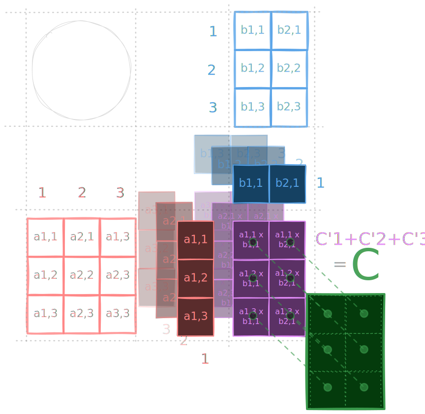
*列行外积*

左矩阵的列，右矩阵的行列向量的外积$a_i^Tb_j=a_i \otimes b_j$体现为子矩阵，所有子矩阵相加等于结果矩阵$C$。
这便是外积视角的几何直观。

--- 

## 结语

矩阵作为一种数学形式，能够很好地解构、分析一些物理现实的运作。  
因为它的强大，越来越多的领域知识都将矩阵作为重要一环。如果没有前置知识，一些领域的知识造就宛若高山，令人叹为观止。  

然而，每一座高山都由微尘磨砺而铸。横看成岭侧成峰，合适的前置知识将作为合适的视角，正如一维矩阵的线性空间，总有拍平，如履平地，从山顶俯瞰的一天。

本文从一些常见的视角对矩阵进行几何直观，希望能有所助。

---
## 附录

### 线性变换P

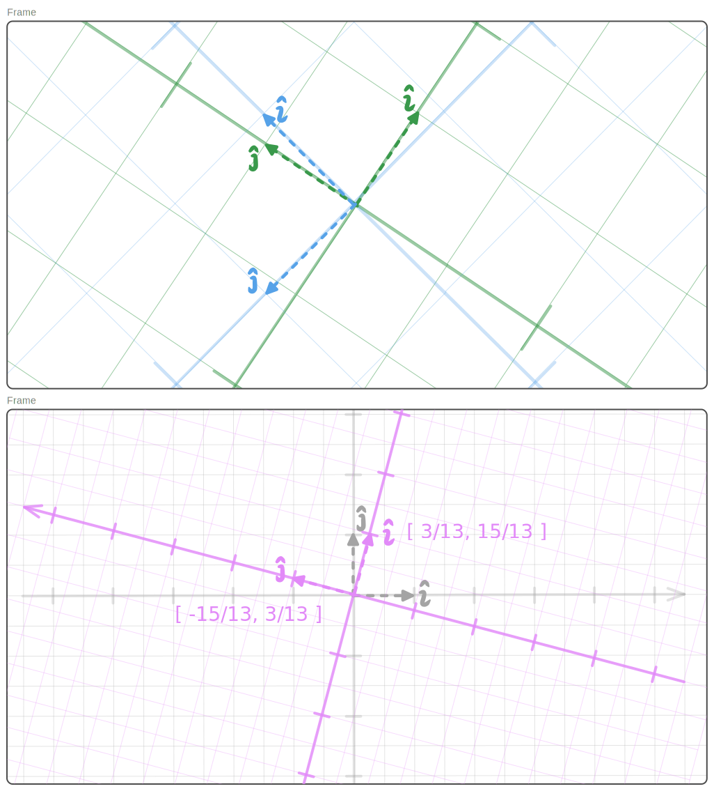
*线性变换P*

将$\color{#56a2e8}\mathbf{B}$的线性空间想象成一张蓝色的纸张，  
而${\color{#39994b}\mathbf{G}}$的线性空间是一张绿色的纸张。

${\color{#e28ef8}\mathbf{P}}$的几何直观就代表着：  
**如何做，才能让绿色纸张变成蓝色纸张?**  

直观上: 逆时针旋转将近90°，同时进行略多于1倍的放大。

